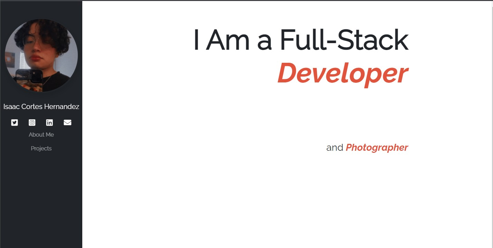

# Portfolio Using MVC

A new try at making my portfolio using the view-model-controller architectural pattern. 

## Getting Started
### Prerequisites

* An Internet Connection

## Built With

* [HTML](https://developer.mozilla.org/en-US/docs/Web/HTML)
* [CSS](https://developer.mozilla.org/en-US/docs/Web/CSS)
* [Javascript](https://developer.mozilla.org/en-US/docs/Web/JavaScript)

## Deployed Link

* [See Live Site](https://young-shore-62055.herokuapp.com/)

## Authors

* **Isaac Cortes Hernandez** 

- [Link to Portfolio Site](https://icortes.github.io/my-first-portfolio/)
- [Link to Github](https://github.com/icortes)
- [Link to LinkedIn](https://www.linkedin.com/in/cortes-isaac)

## License

This project is licensed under the MIT License 